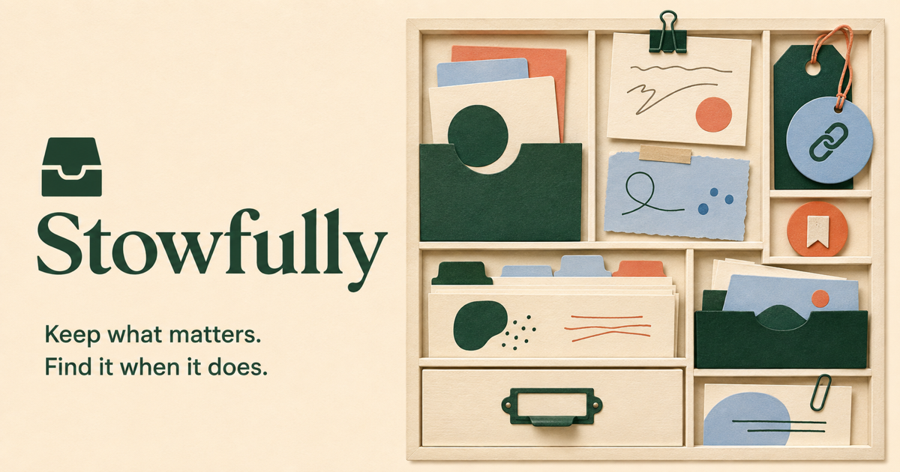

# Stowfully

[](https://stowfully.nex3sss.chatgpt.site)
[](https://github.com/Satwik-P28/stowfully/stargazers)
[](LICENSE)
[](https://github.com/Satwik-P28/stowfully/actions)

**Keep what matters. Find it when it does.**

Stowfully is a **free, local-first visual memory vault** for links, notes, and images — an open-source alternative to paid visual bookmarking tools such as mymind. A calm card library, fast text/tag search, portable exports, and **no required account**.

[**Try the public demo**](https://stowfully.nex3sss.chatgpt.site) · [**Star this repo**](https://github.com/Satwik-P28/stowfully) · [**Run with Docker**](#docker)

Nothing is uploaded. Your keepsakes live in this browser until you export them.



## Why this exists

Visual bookmarking products are lovely until the vault is rented: accounts, plans, and a third party holding the pictures of your life. Stowfully is a **private personal-knowledge vault** you can backup as JSON and restore anywhere.

| | Hosted visual bookmarks | **Stowfully** |
| --- | --- | --- |
| Price | Subscription | Free, MIT, self-host |
| Account | Required | None |
| Data | Vendor cloud | Browser-local + JSON backup |
| Search | Often gated | Titles, notes, URLs, and tags |
| Images | Uploaded | Stay on this device (size-capped) |

## Working MVP

- Capture **links, notes, and small images**
- Search titles, notes, URLs, and tags
- Filter by keepsake type
- Responsive masonry-style library
- Browser-local persistence
- JSON backup and restore
- Per-item deletion
- Seed collection that can be reset by clearing site data

The browser build keeps data in `localStorage`; images are limited to **1.5 MB** to avoid silently exhausting browser storage. It does not fetch remote pages or upload anything.

## Quick start

Requires [Node.js](https://nodejs.org/) 22.13 or newer.

```bash
git clone https://github.com/Satwik-P28/stowfully.git
cd stowfully
npm ci
npm run dev
```

Open `http://localhost:3000`.

## Docker

```bash
docker pull ghcr.io/satwik-p28/stowfully:latest
docker run --rm -p 3000:3000 ghcr.io/satwik-p28/stowfully:latest
```

Or build locally:

```bash
docker compose up --build
```

## Architecture

- React 19 and TypeScript
- Tailwind CSS and shadcn components
- Vinext/Vite with Cloudflare Workers output
- Pure vault validation/search helpers covered by Vitest
- Portable JSON as the canonical backup format

## Quality checks

```bash
npm run check
npm audit
```

## Contributing

If Stowfully became the place you actually put things — **[star the repo](https://github.com/Satwik-P28/stowfully)** so other people can find a vault that does not require an account.

See [CONTRIBUTING.md](CONTRIBUTING.md).

### Blurb for awesome-lists

> **[Stowfully](https://github.com/Satwik-P28/stowfully)** — Local-first visual memory vault for links, notes, and images with JSON backup. `MIT` `Docker` `Nodejs` `Privacy`

Stowfully is an independent project and is not affiliated with mymind or any bookmarking service.

## License

[MIT](LICENSE)
